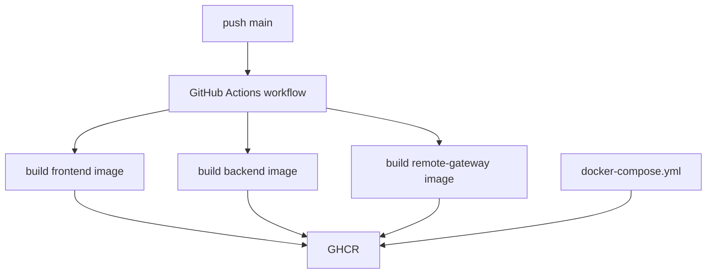

# 变更提案: ghcr-docker-publish

## 元信息
```yaml
类型: 新功能
方案类型: implementation
优先级: P1
状态: 草稿
状态说明: 已实施并归档
创建: 2026-03-25
```

---

## 1. 需求

### 背景
当前仓库没有自动构建并发布 Docker 镜像的 GitHub Actions，根目录 `docker-compose.yml` 仍引用 Docker Hub 上的 `heavrnl/*` 镜像。为了让提交到 `main` 后可以自动生成当前仓库对应的镜像，需要接入 GitHub Container Registry（GHCR）发布链路，并把本地编排切换到仓库所有者名下的 GHCR 镜像。

### 目标
- 在 `main` 分支推送后，自动构建 `frontend`、`backend`、`remote-gateway` 三个 `amd64` 镜像并推送到 GHCR。
- 每次 `main` 推送同时发布 `latest` 与 `sha-<commit>` 两类标签。
- 将根目录 `docker-compose.yml` 切换为引用 `ghcr.io/micah123321/nexus-terminal-{frontend,backend,remote-gateway}:latest`。

### 约束条件
```yaml
时间约束: 无
性能约束: 仅考虑 linux/amd64，暂不引入多架构构建
兼容性约束: 现有三个 Dockerfile 必须继续可用，compose 中的服务名、端口和环境变量保持不变
业务约束: 使用 GitHub 官方 Actions 与 GHCR；提交到 main 后自动发布 latest 和 sha 标签
```

### 验收标准
- [ ] `.github/workflows/` 下新增可在 `main` push 时构建并推送三类镜像的 workflow
- [ ] workflow 发布的镜像仓库为 `ghcr.io/micah123321/nexus-terminal-{frontend,backend,remote-gateway}`
- [ ] 每次 `main` push 至少生成 `latest` 和 `sha-<commit>` 两类标签
- [ ] `docker-compose.yml` 中三个业务镜像已切换到上述 GHCR 地址

---

## 2. 方案

### 技术方案
新增一个基于 `docker/setup-buildx-action`、`docker/login-action`、`docker/metadata-action` 和 `docker/build-push-action` 的 GitHub Actions workflow。workflow 在 `push` 到 `main` 时执行，使用 GitHub 提供的 `GITHUB_TOKEN` 登录 GHCR，按三个独立 job 分别构建 `frontend`、`backend`、`remote-gateway` 镜像。每个 job 都显式指定 `platforms: linux/amd64`，并通过 metadata action 生成 `latest` 与 `sha-<commit>` 标签。随后更新根 `docker-compose.yml` 中的镜像引用到当前仓库 owner 的 GHCR 镜像。

### 影响范围
```yaml
涉及模块:
  - workspace-root: 新增 workflow，更新 docker-compose 镜像来源
  - frontend: 使用现有 Dockerfile 作为 GHCR 构建输入
  - backend: 使用现有 Dockerfile 作为 GHCR 构建输入
  - remote-gateway: 使用现有 Dockerfile 作为 GHCR 构建输入
预计变更文件: 2
```

### 风险评估
| 风险 | 等级 | 应对 |
|------|------|------|
| workflow 使用 `GITHUB_TOKEN` 推送 GHCR 失败（仓库包权限未开启） | 中 | 在 workflow 中显式声明 `packages: write`，并沿用官方登录动作 |
| 某个 Dockerfile 在 GitHub Actions 环境下构建失败 | 中 | 保持各镜像独立 job，便于快速定位失败服务 |
| compose 切到 GHCR 后，用户若未登录私有包仓库将拉取失败 | 低 | 默认假设目标仓库包可公开读取；若后续设为私有，再补充部署说明 |

---

## 3. 技术设计（可选）

### 架构设计


### API设计
N/A

### 数据模型
N/A

---

## 4. 核心场景

### 场景: main 分支自动发布镜像
**模块**: workspace-root  
**条件**: 向 `main` 分支推送提交。  
**行为**: GitHub Actions 自动构建三个服务的 `linux/amd64` 镜像并推送到 GHCR，同时生成 `latest` 和 `sha-<commit>` 标签。  
**结果**: 仓库发布链路与部署编排使用同一组 GHCR 镜像来源。

### 场景: 本地 compose 拉取远程镜像
**模块**: workspace-root  
**条件**: 部署环境执行 `docker compose pull` 或 `docker compose up`。  
**行为**: `docker-compose.yml` 直接从 `ghcr.io/micah123321/*` 拉取三个业务镜像。  
**结果**: compose 不再依赖旧的 Docker Hub 镜像命名。

---

## 5. 技术决策

### ghcr-docker-publish#D001: 使用 GHCR + main push 自动发布 latest 和 sha 标签
**日期**: 2026-03-25  
**状态**: ✅采纳  
**背景**: 需要在不引入额外制品系统的前提下，把当前仓库的 Docker 镜像发布链路收口到 GitHub。  
**选项分析**:
| 选项 | 优点 | 缺点 |
|------|------|------|
| A: GHCR + `latest` + `sha-<commit>` | 与 GitHub 仓库权限一体化，既有稳定标签又可精确追溯到提交 | 会额外产生较多镜像标签 |
| B: 仅发布 `latest` | 配置最简单 | 无法精确回滚到指定提交 |
**决策**: 选择方案 A
**理由**: 该方案兼顾可追溯性与部署便利性，适合当前“提交即发布”的需求。  
**影响**: 影响 `.github/workflows` 和根 `docker-compose.yml`，后续部署默认从 GHCR 拉取镜像。

---

## 6. 成果设计

N/A
