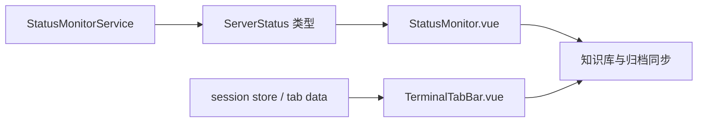

# 变更提案: workspace-monitor-terminal-polish

## 元信息
```yaml
类型: 优化
方案类型: implementation
优先级: P1
状态: 已完成
创建: 2026-03-25
完成: 2026-03-25
```

---

## 1. 需求

### 背景
当前工作区还保留一组未提交的前后端与知识库改动，核心集中在服务器状态监控卡片化展示、顶部终端标签按服务器分组展示，以及对应的知识库归档与索引更新。上一轮曾出现后端 `build` 失败的判断，但基于当前现场重新验证后，前后端构建均已通过，说明本轮重点已经从“抢修编译错误”切换为“梳理剩余改动、补齐一致性并形成干净提交”。

### 目标
- 核对并收尾 `StatusMonitorService`、`StatusMonitor.vue`、`TerminalTabBar.vue` 及相关类型/文案改动，确保行为、字段和 UI 展示一致。
- 校验并整理剩余知识库索引、模块文档和归档目录，避免代码与文档脱节。
- 在不回退现有有效改动的前提下，完成本轮剩余变更的验证与下一次提交。

### 约束条件
```yaml
时间约束: 本轮内完成验证、收尾和提交闭环
性能约束: 不额外引入新的轮询链路或重型依赖
兼容性约束: 保持现有 SSH 状态采集协议和前端工作区结构不变
业务约束: 不删除用户已有改动；提交前必须以当前代码为准重新验证 build
```

### 验收标准
- [ ] `packages/backend` 与 `packages/frontend` 的 `npm run build` 均通过，仅允许保留非阻断警告
- [ ] 状态监控新增字段、前端展示组件与共享类型定义保持一致
- [ ] 顶部终端标签分组交互和相关文案可正常工作，无明显结构性回退
- [ ] `.helloagents` 中的模块文档、索引、归档与本轮代码改动保持一致
- [ ] 形成一笔针对剩余改动的本地提交

---

## 2. 方案

### 技术方案
以“先验证、后补差、再提交”为主线推进。先将剩余未提交改动按监控链路、标签栏链路和知识库链路分组核对；若发现前后端字段、文案、交互或文档存在缺口，则做最小必要修正；若经重新验证确认当前工作区已通过前后端构建且无额外代码缺口，则将本轮工作收束为知识库与归档一致性修正，并形成独立提交。

### 影响范围
```yaml
涉及模块:
  - backend: `StatusMonitorService` 的状态采集字段与容错逻辑
  - frontend: `StatusMonitor.vue` 卡片化监控展示、`TerminalTabBar.vue` 分组标签交互、`server.types.ts` 与 locale 文案
  - knowledge-base: CHANGELOG、INDEX、模块文档和 archive 索引同步
预计变更文件: 12-16
```

### 风险评估
| 风险 | 等级 | 应对 |
|------|------|------|
| 后端采集字段与前端类型/展示不一致，导致运行时显示异常 | 中 | 逐项对照 `ServerStatus`、后端采集逻辑和前端展示字段 |
| 终端标签栏重构后影响原有会话切换/关闭交互 | 中 | 保持原有事件发射接口不变，仅收敛渲染与入口逻辑 |
| 知识库索引与归档目录不一致，导致后续任务恢复错误 | 中 | 提交前统一核对 `.helloagents/archive`、`INDEX.md`、模块文档 |

---

## 3. 技术设计（可选）

### 架构设计


### 数据模型
| 字段 | 类型 | 说明 |
|------|------|------|
| `memFree` | `number` | 空闲内存，MB |
| `memCached` | `number` | 缓存内存，MB |
| `diskAvailable` | `number` | 可用磁盘空间，KB |
| `diskMountPoint` | `string` | 根挂载点 |
| `diskFsType` | `string` | 文件系统类型 |
| `diskDevice` | `string` | 归一化后的块设备名 |
| `diskReadRate` | `number` | 磁盘读取速率，Bytes/sec |
| `diskWriteRate` | `number` | 磁盘写入速率，Bytes/sec |

---

## 4. 核心场景

### 场景: 工作区状态监控卡片
**模块**: frontend, backend
**条件**: 用户在 `/workspace` 中选中一个有效 SSH 会话，并开启状态轮询。
**行为**: 后端采集内存/磁盘扩展字段，前端以卡片形式展示内存占比、缓存/空闲、磁盘设备信息、读写速率和挂载表格。
**结果**: 用户可以在不切换页面的情况下读取更完整的服务器资源状态。

### 场景: 同服务器多终端标签分组
**模块**: frontend
**条件**: 用户为同一 SSH 连接打开多个终端会话。
**行为**: 标签栏按连接分组显示服务器组头、终端子标签和组尾新增按钮，全局新增按钮仅用于选择其他服务器。
**结果**: 多终端关系更直观，新增终端入口不再与“切换服务器”混淆。

### 场景: 剩余知识库与提交闭环
**模块**: knowledge-base
**条件**: 本轮代码改动已完成验证，准备收尾提交。
**行为**: 更新 CHANGELOG、模块文档、归档索引与归档目录，并在验证通过后形成新的本地提交。
**结果**: 代码和知识库保持一致，后续任务可基于归档恢复上下文。

---

## 5. 技术决策

### workspace-monitor-terminal-polish#D001: 以当前通过构建的剩余改动为基线继续收尾，而不是回退后重做
**日期**: 2026-03-25
**状态**: ✅采纳
**背景**: 用户要求先修复后端 `build` 失败，再收尾剩余改动；但重新核验现场后发现前后端构建已经通过，问题已不再是编译阻断，而是未提交改动的整合与闭环。
**选项分析**:
| 选项 | 优点 | 缺点 |
|------|------|------|
| A: 以当前工作区为基线继续收尾 | 基于真实现场推进，避免误修已解决问题，能直接闭环提交 | 需要重新核对未提交改动范围 |
| B: 假定 build 仍失败，先回退或重写状态监控代码 | 思路简单 | 容易覆盖已有有效改动，且与当前现场不一致 |
**决策**: 选择方案A
**理由**: 真实校验结果优先于旧结论。当前 `build` 已通过，应把精力放在补齐剩余差异和提交闭环上，而不是对不存在的阻断做重复修复。
**影响**: backend、frontend、knowledge-base

---

## 6. 成果设计

### 设计方向
- **美学基调**: 工业监控面板，保持深色终端工作台语境，用高信息密度卡片承载资源状态
- **记忆点**: 内存环形占比与磁盘立式使用条组成的双卡片监控组合
- **参考**: 现有深色工作区视觉语言 + 用户当前未提交的卡片化实现

### 视觉要素
- **配色**: 延续深色背景，使用绿色/灰色/红色区分空闲、缓存和已用状态，磁盘与网络保留高对比强调色
- **字体**: 沿用项目现有字体体系，数据值优先使用等宽字体提升可读性
- **布局**: 在右侧状态监控区域引入双卡片块，卡片内部用环形/立式指标和表格混排
- **动效**: 保留进度与状态切换的平滑过渡，不额外增加炫技动画
- **氛围**: 使用边框、浅阴影和半透明背景维持工作台的设备面板感

### 技术约束
- **可访问性**: 保证文本与背景具备可读对比度，关键数字信息不只依赖颜色表达
- **响应式**: 小屏下卡片需降为单列，表格和指标区块允许纵向堆叠
