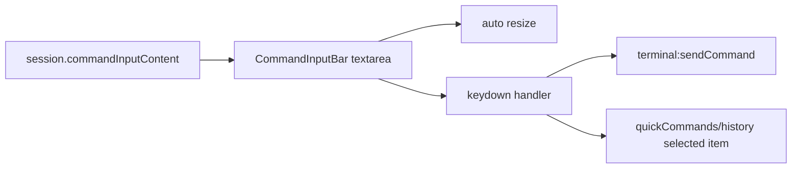

# 变更提案: command-input-multiline-shortcut

## 元信息
```yaml
类型: 优化
方案类型: implementation
优先级: P1
状态: 已完成
创建: 2026-03-25
完成: 2026-03-25
```

---

## 1. 需求

### 背景
当前工作区底部命令输入条仍是单行 `input`，默认按 `Enter` 立即发送到终端。这会阻碍输入多行命令或临时脚本，也容易在编辑中误发送。用户希望把发送动作切换为 `Ctrl+Shift+Enter`，并让输入框按内容自动扩展为多行。

### 目标
- 将终端命令发送快捷键从单独 `Enter` 改为 `Ctrl+Shift+Enter`。
- 将命令输入框升级为支持多行输入和按内容动态增高。
- 保留现有会话级命令草稿状态、搜索切换、命令历史/快捷指令联动和空命令发送能力。

### 约束条件
```yaml
时间约束: 本轮内完成前端改造与基础验证
性能约束: 自动增高应只作用于当前输入框，不引入新的重型依赖
兼容性约束: 保持现有 session store 的 commandInputContent 数据结构不变
业务约束: 不破坏快捷指令/命令历史选中后回车发送逻辑；多行输入最多扩展约 6 行，超出后内部滚动
```

### 验收标准
- [ ] `CommandInputBar.vue` 支持多行命令输入，输入框随内容自动增高，最大高度约 6 行
- [ ] 普通 `Enter` 仅插入换行，不再直接发送；`Ctrl+Shift+Enter` 可发送当前命令内容
- [ ] 快捷指令/命令历史存在选中项时，发送逻辑仍可正常工作
- [ ] 中英文/日文占位提示同步更新为新的快捷键说明
- [ ] `packages/frontend` 的类型检查与构建通过

---

## 2. 方案

### 技术方案
将 `CommandInputBar.vue` 中的单行 `input` 改为 `textarea`，继续通过 `currentSessionCommandInput` 读写当前会话的命令草稿。新增输入框高度同步逻辑，在内容变化、会话切换和组件挂载后按 `scrollHeight` 重新计算高度，并限制最大高度。键盘处理改为区分三类路径：`Ctrl+Shift+Enter` 发送当前输入、存在同步面板选中项时优先发送选中命令、普通 `Enter` 保持换行。

### 影响范围
```yaml
涉及模块:
  - frontend: `CommandInputBar.vue` 的输入组件、快捷键与高度同步逻辑
  - frontend: locale 文案中的命令输入占位提示
预计变更文件: 3-4
```

### 风险评估
| 风险 | 等级 | 应对 |
|------|------|------|
| `textarea` 替换后影响现有焦点切换、搜索切换或样式布局 | 中 | 复用现有 ref 与 focus action，只做输入节点最小替换 |
| 自动增高在切换会话或清空输入后高度残留 | 中 | 在内容变更、activeSession 变更和发送后统一触发高度重算 |
| 快捷指令/命令历史列表的选中发送逻辑被新快捷键覆盖 | 中 | 保留现有选中命令优先路径，并改为新快捷键触发 |

---

## 3. 技术设计（可选）

### 架构设计


### 数据模型
| 字段 | 类型 | 说明 |
|------|------|------|
| `commandInputRef` | `HTMLTextAreaElement \| null` | 命令输入框 DOM 引用 |
| `maxCommandInputHeight` | `number` | 动态高度上限，约 6 行 |
| `currentSessionCommandInput` | `string` | 当前活动会话的命令草稿内容 |

---

## 4. 核心场景

### 场景: 多行命令编辑并发送
**模块**: frontend
**条件**: 用户在工作区命令输入条中输入多行命令或脚本片段。
**行为**: 输入框按内容自动扩展高度，普通 `Enter` 插入换行，`Ctrl+Shift+Enter` 发送当前内容到终端。
**结果**: 用户可在发送前完整编辑多行命令，不会因单独回车误触发发送。

### 场景: 选中快捷指令或历史命令后发送
**模块**: frontend
**条件**: 命令输入同步到快捷指令或命令历史，且列表中存在当前选中项。
**行为**: 用户按发送快捷键时优先发送选中的命令项，并清空输入框与选中状态。
**结果**: 原有联动发送体验保持不变，只是发送触发键改为新组合键。

---

## 5. 技术决策

### command-input-multiline-shortcut#D001: 使用 `textarea` + 自动高度同步，而不是保留单行 `input`
**日期**: 2026-03-25
**状态**: ✅采纳
**背景**: 需求同时要求“多行输入”和“动态支持多行”，单行 `input` 无法自然承载换行编辑与高度增长。
**选项分析**:
| 选项 | 优点 | 缺点 |
|------|------|------|
| A: 改为 `textarea` 并动态调整高度 | 原生支持换行，改动集中，易于和现有 v-model/focus 逻辑兼容 | 需要额外处理高度重置和最大高度 |
| B: 保留 `input`，另做弹层或隐藏编辑器 | 可保留单行样式 | 交互割裂，改动范围更大，和用户诉求不匹配 |
**决策**: 选择方案A
**理由**: `textarea` 是最小且直接满足需求的实现路径，可以在不改 store 结构的前提下提供多行编辑与动态高度能力。
**影响**: frontend

---

## 6. 成果设计

### 设计方向
- **美学基调**: 延续现有终端工作台的轻量工具条风格，不引入额外视觉噪声
- **记忆点**: 单行输入自然生长为多行命令编辑区，但整体仍保持底部命令条的一体化布局
- **参考**: 当前 `CommandInputBar` 样式语言 + 常见终端/IDE 命令面板的多行输入体验

### 视觉要素
- **配色**: 保持现有 `bg-input`、`border-border/50`、`focus:ring-primary/50` 体系不变
- **字体**: 沿用当前项目输入控件字体体系，保持终端工作台一致性
- **布局**: 命令框横向占满剩余空间，纵向在 1 行到约 6 行之间平滑扩展
- **动效**: 保留现有 `transition-all duration-300 ease-in-out`，让高度变化与 focus 态自然过渡
- **氛围**: 不额外增加装饰，重点保持工具型界面的克制与稳定

### 技术约束
- **可访问性**: 保留 placeholder 与键盘操作，避免纯图标表达发送规则
- **响应式**: 在移动端仍需保持输入框可用，不挤压既有工具按钮
