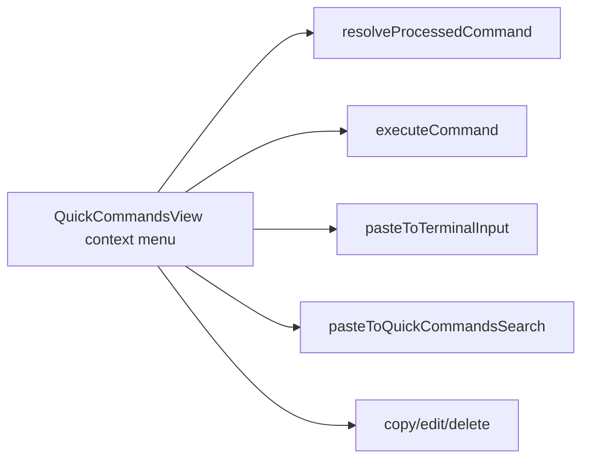

# 变更提案: quickcommands-context-menu-actions

## 元信息
```yaml
类型: 优化
方案类型: implementation
优先级: P1
状态: 已完成
创建: 2026-03-26
完成: 2026-03-26
```

---

## 1. 需求

### 背景
当前快捷命令列表项虽然支持右键菜单，但菜单中只有“发送到全部会话”一个动作，和用户提供的参考图不一致。用户希望在快捷命令部分的右键菜单中补齐常用动作，包括立即执行、粘贴到终端输入框、复制命令、粘贴到快捷输入框、编辑和删除。

### 目标
- 将快捷命令右键菜单扩展为与参考图接近的多动作菜单。
- 保持“立即执行”为对当前活动 SSH 会话直接发送命令。
- 将“粘贴到终端”实现为写入底部命令输入框但不发送。
- 将“粘贴到快捷输入框”实现为写入快捷命令顶部搜索输入框，便于二次筛选或编辑。

### 约束条件
```yaml
时间约束: 本轮内完成前端菜单扩展与基础验证
性能约束: 不引入新依赖，沿用现有视图、store 和事件总线
兼容性约束: 保持现有快捷命令执行、复制、编辑、删除和“发送到全部会话”能力不回退
业务约束: “粘贴到终端”必须只写入命令输入框，不回车发送；菜单样式尽量贴近参考图
```

### 验收标准
- [ ] 快捷命令右键菜单包含“立即执行 / 粘贴到终端 / 复制命令 / 粘贴到快捷输入框 / 编辑 / 删除”
- [ ] “立即执行”继续向当前活动 SSH 会话发送处理后的命令
- [ ] “粘贴到终端”仅写入底部命令输入框，不自动发送
- [ ] “粘贴到快捷输入框”写入快捷命令顶部搜索输入框并刷新筛选
- [ ] `packages/frontend` 的构建验证通过

---

## 2. 方案

### 技术方案
继续在 `QuickCommandsView.vue` 内扩展现有右键菜单，不新拆组件。将快捷命令处理逻辑抽成“解析命令内容”和“执行菜单动作”两个层级：命令变量替换等公共处理复用给“立即执行”和“粘贴到终端”，复制/编辑/删除则复用现有函数。菜单模板改为图标 + 文案列表，并保留“发送到全部会话”作为扩展动作。文案统一写入 locale。

### 影响范围
```yaml
涉及模块:
  - frontend: `QuickCommandsView.vue` 的右键菜单结构与动作逻辑
  - frontend: 快捷命令 locale 文案
预计变更文件: 3-4
```

### 风险评估
| 风险 | 等级 | 应对 |
|------|------|------|
| 右键菜单新增动作后与现有点击、hover 按钮行为冲突 | 中 | 仅在现有 context menu 状态机上扩展，不改列表项主点击路径 |
| “粘贴到终端”与“立即执行”语义混淆，导致误发送 | 中 | 将终端输入框写入逻辑单独封装，明确不触发 `terminal:sendCommand` |
| locale 文案分散，容易遗漏多语言同步 | 低 | 同轮同步 zh-CN / en-US / ja-JP |

---

## 3. 技术设计（可选）

### 架构设计


### 数据模型
| 字段 | 类型 | 说明 |
|------|------|------|
| `quickCommandContextTargetCommand` | `QuickCommandFE \| null` | 当前右键命中的快捷命令 |
| `quickCommandContextMenuVisible` | `boolean` | 右键菜单显示状态 |
| `activeSessionId` | `string \| undefined` | 当前活动 SSH 会话，用于“立即执行”和“粘贴到终端” |

---

## 4. 核心场景

### 场景: 右键快捷命令后立即执行
**模块**: frontend
**条件**: 用户在快捷命令列表中右键某条命令，且当前存在活动 SSH 会话。
**行为**: 点击“立即执行”后，对命令完成变量替换并发送到当前活动会话。
**结果**: 用户无需左键执行即可从右键菜单直接运行命令。

### 场景: 右键快捷命令后粘贴到终端输入框
**模块**: frontend
**条件**: 用户在快捷命令列表中右键某条命令，且当前存在活动 SSH 会话。
**行为**: 点击“粘贴到终端”后，将处理后的命令写入底部命令输入框，但不触发发送。
**结果**: 用户可以继续手动修改命令，再自行决定何时发送。

### 场景: 右键快捷命令后回填到快捷输入框
**模块**: frontend
**条件**: 用户在快捷命令列表中右键某条命令。
**行为**: 点击“粘贴到快捷输入框”后，将命令内容写入快捷命令顶部搜索框，并触发筛选。
**结果**: 用户可基于命令内容快速筛选、比对或继续编辑快捷命令。

---

## 5. 技术决策

### quickcommands-context-menu-actions#D001: 继续在 `QuickCommandsView.vue` 内扩展菜单逻辑，而不是新建独立上下文菜单组件
**日期**: 2026-03-26
**状态**: ✅采纳
**背景**: 当前右键菜单已经在 `QuickCommandsView.vue` 内实现了显示、定位和关闭逻辑，只是动作过少。
**选项分析**:
| 选项 | 优点 | 缺点 |
|------|------|------|
| A: 直接扩展现有右键菜单 | 改动集中，复用现有状态和依赖，交付速度快 | 菜单逻辑继续留在单文件内 |
| B: 抽离独立菜单组件 | 结构更分明 | 需要额外抽 props / emits，当前收益不高 |
**决策**: 选择方案A
**理由**: 这是一次局部交互增强，现有右键菜单基础已经足够，直接扩展更符合最小改动原则。
**影响**: frontend

---

## 6. 成果设计

### 设计方向
- **美学基调**: 延续当前深色工作台菜单风格，接近参考图的紧凑右键菜单
- **记忆点**: 图标与文案并列的多动作菜单，删除项保留危险色强调
- **参考**: 用户提供的右键菜单截图

### 视觉要素
- **配色**: 常规动作使用前景色与 hover 高亮，删除项使用错误色
- **字体**: 沿用当前界面菜单字号和字体体系
- **布局**: 单列垂直菜单项，图标左对齐，文字紧凑排列
- **动效**: 保持现有 hover 颜色过渡
- **氛围**: 保持工具型菜单克制感，不过度装饰

### 技术约束
- **可访问性**: 菜单项文案明确区分“立即执行”和“粘贴到终端”
- **响应式**: 保持现有防越界定位逻辑
