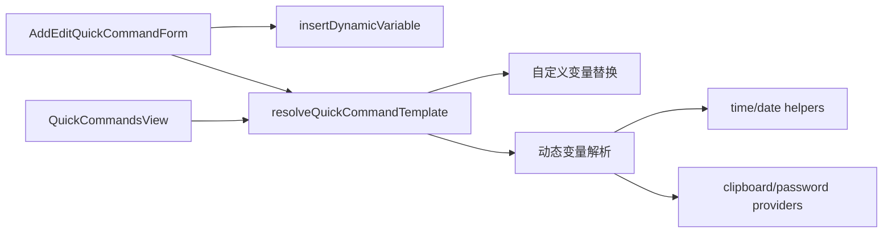

# 变更提案: quickcommands-dynamic-variables

## 元信息
```yaml
类型: 新功能
方案类型: implementation
优先级: P1
状态: 草稿
创建: 2026-03-26
```

---

## 1. 需求

### 背景
当前快捷指令仅支持用户手动维护的 `${变量名}` 替换，编辑弹窗左侧也只有“变量管理”区。用户希望在“编辑快捷指令”部分直接看到一组可点击插入的动态变量，例如日期、时间、UUID、随机串、剪贴板和 SSH 登录密码，并在真正执行快捷指令时自动填充这些值。

### 目标
- 在编辑快捷指令弹窗中新增“动态变量”说明与点击插入能力。
- 支持 `${{date}}`、`${{date:YYYYMMDD}}` 这类动态变量写法，并保留现有 `${NAME}` 自定义变量能力。
- 统一“编辑弹窗内执行”和“快捷指令列表直接执行”两条链路的变量解析逻辑，避免一处支持、一处失效。

### 约束条件
```yaml
时间约束: 本轮内完成前端实现与构建验证
性能约束: 不引入新依赖，优先复用现有 Vue/Pinia 与浏览器原生能力
兼容性约束: 现有 `${变量名}` 自定义变量保存、编辑、执行行为不得回退
业务约束:
  - 动态变量点击后应插入到当前指令文本中，而不是只做展示
  - 自动填充必须同时覆盖“编辑弹窗执行”和“列表直接执行”
  - 剪贴板类变量取值失败时不能导致整个执行链路崩溃
```

### 验收标准
- [ ] 编辑快捷指令弹窗中出现“动态变量”区，至少覆盖日期时间、唯一标识和系统三类变量
- [ ] 点击动态变量项后，指令文本区域会插入对应占位符
- [ ] `${{date}}`、`${{time}}`、`${{timestamp}}`、`${{week}}`、`${{uuid}}`、`${{random}}`、`${{random:8}}`、`${{clipboard}}`、`${{password}}` 在执行时会被自动填充
- [ ] `${{date:YYYYMMDD}}`、`${{time:HHmmss}}` 这类带格式参数的变量可正确生效
- [ ] 现有 `${变量名}` 自定义变量替换继续生效
- [ ] `packages/frontend` 构建验证通过

---

## 2. 方案

### 技术方案
新增一个前端快捷指令变量解析工具，将“自定义变量替换 + 动态变量填充 + 未定义变量检查”收敛到同一处。`AddEditQuickCommandForm.vue` 负责提供动态变量清单、说明文案和点击插入；`QuickCommandsView.vue` 与表单内“执行”按钮都改为调用同一套解析函数。动态变量按运行时来源分层实现：

- 时间类变量通过前端当前时间即时生成；
- `uuid` 使用浏览器 `crypto.randomUUID()`，必要时做降级；
- `random[:len]` 由本地字符集生成；
- `clipboard` 使用浏览器 Clipboard API 读取；
- `password` 优先从当前活动会话关联的连接信息中读取保存的登录密码字段，取不到时按空串处理并给出提示。

### 影响范围
```yaml
涉及模块:
  - frontend: 快捷指令编辑弹窗 UI
  - frontend: 快捷指令执行链路
  - frontend: locale 文案
预计变更文件: 5-6
```

### 风险评估
| 风险 | 等级 | 应对 |
|------|------|------|
| 两条执行链路继续复制解析逻辑，后续容易再次偏离 | 中 | 抽出共享解析工具，只保留调用层差异 |
| `clipboard` 读取受浏览器权限或交互上下文限制 | 中 | 读取失败时返回空串并给出非阻断提示 |
| `password` 来源不稳定，不同连接类型字段可能不完全一致 | 中 | 先基于当前 SSH 连接常规密码字段取值，取不到时保持空串并避免抛错 |
| locale 文案遗漏导致编辑区出现回退文案 | 低 | 同轮同步 zh-CN / en-US / ja-JP |

---

## 3. 技术设计（可选）

### 架构设计


### 数据模型
| 字段 | 类型 | 说明 |
|------|------|------|
| `QuickCommandVariableContext` | object | 执行时上下文，包含自定义变量、活动会话和连接信息 |
| `DynamicVariableDefinition` | object | 动态变量展示项定义，包含 key、label、description、example |
| `ResolveQuickCommandResult` | object | 返回处理后命令、未定义变量、动态变量告警 |

---

## 4. 核心场景

### 场景: 在编辑快捷指令时点击插入动态变量
**模块**: frontend  
**条件**: 用户打开“编辑快捷指令”弹窗。  
**行为**: 用户点击动态变量卡片后，将对应 `${{...}}` 占位符插入到指令文本中。  
**结果**: 用户不需要手写复杂占位符格式。

### 场景: 在编辑弹窗内执行带动态变量的快捷指令
**模块**: frontend  
**条件**: 当前存在活动 SSH 会话，指令中包含动态变量或自定义变量。  
**行为**: 点击“执行”后统一解析模板，再发送处理后的命令。  
**结果**: 编辑态预执行与保存后执行行为一致。

### 场景: 直接从快捷指令列表执行带动态变量的命令
**模块**: frontend  
**条件**: 用户在工作台快捷指令列表中点击某条命令。  
**行为**: 列表执行逻辑复用共享解析器，自动填充动态变量后发送。  
**结果**: 保存后的快捷指令在运行态自动得到真实值。

---

## 5. 技术决策

### quickcommands-dynamic-variables#D001: 用共享解析工具统一快捷指令变量处理，而不是在两个视图内各自扩展
**日期**: 2026-03-26
**状态**: ✅采纳
**背景**: 当前 `AddEditQuickCommandForm.vue` 和 `QuickCommandsView.vue` 已各自实现一份 `${变量名}` 替换逻辑，继续在两个位置分别补动态变量会放大分叉风险。
**选项分析**:
| 选项 | 优点 | 缺点 |
|------|------|------|
| A: 抽共享解析工具 | 规则唯一、两条执行链一致、后续容易扩展更多变量 | 需要多一个工具文件 |
| B: 原位各自扩展 | 改动表面更直接 | 逻辑重复，后续维护成本更高 |
**决策**: 选择方案A
**理由**: 本次需求的核心不是单纯加一块 UI，而是让“编辑态执行”和“列表态执行”共享同一套变量解析语义。
**影响**: frontend

---

## 6. 成果设计

### 设计方向
- **美学基调**: 延续当前快捷指令编辑弹窗的工具型深色界面，在左侧变量区域内加入结构清晰的动态变量分组
- **记忆点**: 每个动态变量同时展示名称、说明、示例，占位符可以一键插入
- **参考**: 用户提供的动态变量列表说明

### 视觉要素
- **配色**: 复用现有输入区与边框体系，用主色 hover 强调“可点击插入”
- **字体**: 标题沿用当前界面字体，变量占位符和示例使用等宽字体
- **布局**: 左侧分组列表纵向展开，变量项内部保持“名称 + 描述 + 示例”三段式
- **动效**: 沿用当前按钮 hover 过渡，不额外加入复杂动画
- **氛围**: 以“清楚可用”为主，避免文档墙式堆砌

### 技术约束
- **响应式**: 在当前弹窗可调整宽高前提下保持左右栏可滚动
- **可访问性**: 动态变量项需有明确 hover/click 反馈，示例文本可复制识别
