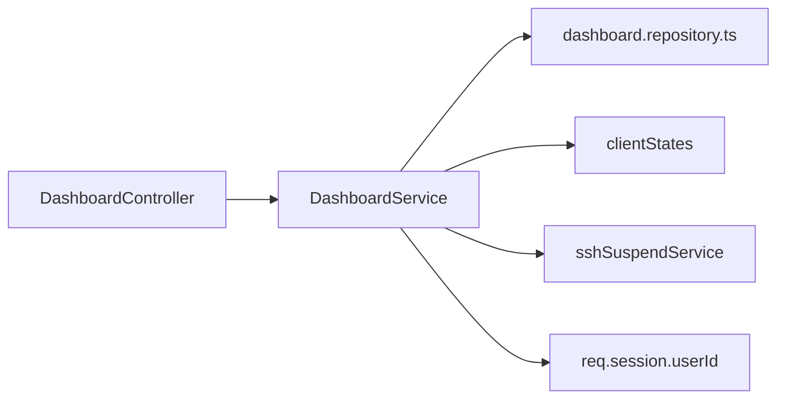

# 变更提案: dashboard-live-session-metrics

## 元信息
```yaml
类型: 新功能
方案类型: implementation
优先级: P1
状态: 草稿
创建: 2026-03-26
```

---

## 1. 需求

### 背景
首页 dashboard 已经具备稳定统计能力，但仍缺少运行态视角。用户继续要求补“在线会话数/实时指标”，并明确选择“混合视角”，意味着首页同时需要展示当前登录用户的运行态会话信息，以及整个系统范围内的总在线会话概况。

### 目标
- 在现有 dashboard summary 基础上补充运行态指标，而不是另起一套接口。
- 同时展示“当前用户视角”和“系统总览视角”的在线 SSH / 挂起会话指标。
- 补充能体现实时性的附加指标，例如被监控中的活跃状态流数量，让首页更接近真实运维总控台。
- 保持首页首屏仍为单次 summary 请求，不要求前端直接订阅 WebSocket 状态。

### 约束条件
```yaml
时间约束: 本轮内完成前后端联动与基础构建验证
性能约束: 运行态统计应在现有 dashboard summary 接口内组合返回，避免首页新增额外请求
兼容性约束: 不改变现有 workspace WebSocket 协议与挂起会话 API 语义
业务约束: 当前用户口径必须与后端登录态一致；系统口径必须来自后端共享运行态，而不是浏览器本地 session store 猜测
```

### 验收标准
- [ ] `GET /api/v1/dashboard/summary` 返回新增的 live metrics 字段
- [ ] 首页同时展示当前用户在线 SSH / 挂起会话数与系统总在线 SSH / 挂起会话数
- [ ] 首页补充至少一个与实时运行态有关的附加指标，例如当前活跃状态监控流数量
- [ ] 前端 UI 对新增实时指标完成中英日文案适配
- [ ] `packages/backend` 与 `packages/frontend` 构建通过

---

## 2. 方案

### 技术方案
延续现有 `dashboard` 业务域，但把运行态统计从纯数据库聚合扩展为“数据库统计 + 内存运行态组合”。数据库部分继续由 `dashboard.repository.ts` 提供稳定统计；运行态部分由 `dashboard.service.ts` 直接组合后端共享的 `clientStates` 与 `sshSuspendService`：前者提供系统范围和按当前 `req.session.userId` 过滤的在线 SSH 会话数量，并进一步统计处于状态监控中的会话数量；后者补充当前用户与系统范围的挂起会话数。前端沿用现有 `dashboard.store.ts`，在 `DashboardOverviewPanel.vue` 中新增“实时会话”板块，使用清晰的双列卡片同时呈现“我的会话”和“系统会话”。

### 影响范围
```yaml
涉及模块:
  - backend: 扩展 dashboard summary 组合逻辑，补运行态统计
  - backend: 为 sshSuspendService 暴露系统级计数方法
  - frontend: 扩展 summary 类型与总览组件
  - frontend: 更新 dashboard 文案
预计变更文件: 6-9
```

### 风险评估
| 风险 | 等级 | 应对 |
|------|------|------|
| 前端本地 session store 与后端真实在线会话不一致 | 中 | 在线/挂起口径统一以后端运行态为准，只在首页展示后端汇总结果 |
| `clientStates` 中可能包含正在恢复、挂起标记中或半断开的会话 | 中 | 统计时显式按状态字段过滤，优先统计未被服务接管的可用活跃会话 |
| `sshSuspendService` 目前只有按用户列出接口，没有系统汇总接口 | 低 | 为服务补一个只读统计方法，不改现有对外 API |

---

## 3. 技术设计

### 架构设计


### API设计
#### GET /api/v1/dashboard/summary
- **新增响应字段**:
```json
{
  "liveMetrics": {
    "currentUser": {
      "activeSshSessions": 0,
      "suspendedSessions": 0
    },
    "system": {
      "activeSshSessions": 0,
      "suspendedSessions": 0,
      "statusStreams": 0
    }
  }
}
```

### 数据模型
| 字段 | 类型 | 说明 |
|------|------|------|
| `liveMetrics.currentUser.activeSshSessions` | `number` | 当前登录用户的活跃 SSH 会话数 |
| `liveMetrics.currentUser.suspendedSessions` | `number` | 当前登录用户的挂起会话数 |
| `liveMetrics.system.activeSshSessions` | `number` | 系统范围的活跃 SSH 会话数 |
| `liveMetrics.system.suspendedSessions` | `number` | 系统范围的挂起会话数 |
| `liveMetrics.system.statusStreams` | `number` | 当前处于状态轮询中的活跃会话数 |

---

## 4. 核心场景

### 场景: 当前用户查看自己的在线与挂起会话
**模块**: frontend / backend
**条件**: 用户已登录并打开首页 dashboard。
**行为**: 后端基于当前 session 的 `userId` 统计用户活跃 SSH 会话和挂起会话，并在首页实时会话面板中显示。
**结果**: 用户能快速判断“我当前开了多少会话、还有多少挂起会话待恢复”。

### 场景: 管理员查看系统整体运行态
**模块**: frontend / backend
**条件**: 首页 dashboard 已完成 summary 拉取。
**行为**: 后端同时返回系统总活跃 SSH 会话数、总挂起会话数和状态监控流数量。
**结果**: 首页能同时表达“我的视角”和“系统视角”，满足混合视角需求。

---

## 5. 技术决策

### dashboard-live-session-metrics#D001: 运行态指标继续并入 summary 接口，而不是前端再建额外实时 API
**日期**: 2026-03-26
**状态**: ✅采纳
**背景**: 现有 dashboard 已经是单接口驱动。继续拆新接口只会增加首页请求数和前端状态拼装复杂度。
**选项分析**:
| 选项 | 优点 | 缺点 |
|------|------|------|
| A: 扩展现有 `/api/v1/dashboard/summary` | 首页保持单请求，口径集中，最适合当前仪表盘架构 | service 层需同时组合数据库与运行态来源 |
| B: 新增独立 `/api/v1/dashboard/live` | 可把稳定统计和实时统计分离 | 首页需要二次请求和额外错误处理，前端复杂度上升 |
**决策**: 选择方案A
**理由**: 这轮增强是现有 dashboard 的自然延展，不值得拆出第二条首页专用链路。
**影响**: backend, frontend

### dashboard-live-session-metrics#D002: 在线/挂起统计口径以后端运行态为准，不使用浏览器本地 session store 作为首页事实来源
**日期**: 2026-03-26
**状态**: ✅采纳
**背景**: 前端 session store 只能反映当前浏览器标签页，无法代表同一用户其他浏览器窗口、恢复中的会话或后端已接管的挂起状态。
**选项分析**:
| 选项 | 优点 | 缺点 |
|------|------|------|
| A: 后端 `clientStates + sshSuspendService` 统一统计 | 口径统一，能同时覆盖系统和当前用户 | 需要后端 service 增加只读组合逻辑 |
| B: 首页直接读前端 `session.store` | 实现快 | 只能看到当前浏览器局部状态，无法满足混合视角 |
**决策**: 选择方案A
**理由**: 用户明确要“当前用户 + 系统总览”混合视角，只能以后端运行态作为事实源。
**影响**: backend, frontend

---

## 6. 成果设计

### 设计方向
- **美学基调**: 保持现有 dashboard 驾驶舱风格，但把运行态指标做成更“控制台式”的双层面板
- **记忆点**: 首页同时出现“我的会话 / 系统会话”两组清晰分栏，不再只有静态总量
- **参考**: 当前 dashboard 卡片体系 + 运维控制台常见的 live session summary

### 视觉要素
- **配色**: 当前用户指标偏主色和绿色，系统总览指标偏青蓝和琥珀，避免与稳定总量卡片混淆
- **字体**: 沿用现有项目后台字体体系
- **布局**: 运行态指标独立为一块 summary panel，位于统计卡片区之后、图表区之前
- **动效**: 只保留轻量 hover 和数字层级，不增加复杂动画
- **氛围**: 强调“控制面板”而非“报表页”，以密度和清晰分组为主

### 技术约束
- **可访问性**: 每个实时指标必须带文字标签，不用纯 icon 表达
- **响应式**: 窄屏下“当前用户 / 系统总览”两组指标要能自然折叠为单栏
