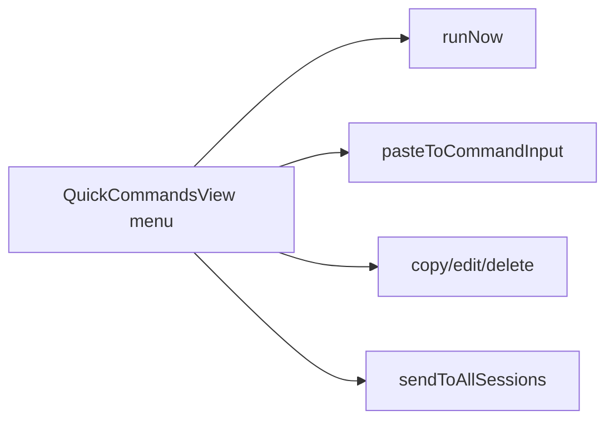

# 变更提案: quickcommands-context-menu-polish

## 元信息
```yaml
类型: 优化
方案类型: implementation
优先级: P1
状态: 草稿
创建: 2026-03-26
```

---

## 1. 需求

### 背景
上一轮已经为快捷命令补上右键菜单，但用户进一步确认了三个运行态问题：菜单背景出现透明效果；不再需要“粘贴到终端”单独菜单项；原“粘贴到快捷输入框”应改成“粘贴到命令输入框”的语义和位置，即点击后写入底部终端命令输入框但不发送。

### 目标
- 将快捷命令右键菜单改为实底不透明菜单。
- 移除“粘贴到终端”菜单项。
- 将原“粘贴到快捷输入框”改为“粘贴到命令输入框”，并执行写入底部命令输入框但不发送的行为。

### 约束条件
```yaml
时间约束: 本轮内完成右键菜单修正与前端验证
性能约束: 不新增依赖，仅调整现有菜单结构和前端逻辑
兼容性约束: 保留立即执行、复制命令、发送到全部服务器、编辑、删除等动作
业务约束: 粘贴到命令输入框必须只写入底部命令输入框，不自动发送
```

### 验收标准
- [ ] 右键菜单背景为实底不透明，不再出现透明感
- [ ] 菜单中不再显示“粘贴到终端”
- [ ] “粘贴到命令输入框”点击后写入底部命令输入框，但不发送
- [ ] locale 文案同步更新
- [ ] `packages/frontend` 构建通过

---

## 2. 方案

### 技术方案
继续在 `QuickCommandsView.vue` 上做最小修正。菜单容器改为显式深色背景与更强边框/阴影；删除“粘贴到终端” DOM 项与对应 action；把原 `pasteToQuickInput` 动作重命名并直接复用现有“写入底部命令输入框”的逻辑。同步三套 locale 文案与成功提示。

### 影响范围
```yaml
涉及模块:
  - frontend: `QuickCommandsView.vue` 右键菜单结构、样式和动作映射
  - frontend: 快捷命令相关 locale 文案
预计变更文件: 3-4
```

### 风险评估
| 风险 | 等级 | 应对 |
|------|------|------|
| 菜单背景样式修正后与现有主题变量冲突 | 低 | 使用更明确的深色背景与现有边框/阴影组合，避免透明变量色 |
| 删除菜单项后动作顺序与用户预期不一致 | 低 | 让“粘贴到命令输入框”顶替原位置 |
| 文案与实际行为再次不一致 | 中 | 同时修改菜单文案、动作枚举和成功提示 |

---

## 3. 技术设计（可选）

### 架构设计


### 数据模型
| 字段 | 类型 | 说明 |
|------|------|------|
| `quickCommandContextMenuVisible` | `boolean` | 右键菜单显示状态 |
| `quickCommandContextTargetCommand` | `QuickCommandFE \| null` | 当前菜单目标命令 |
| `activeSessionId` | `string \| undefined` | 当前活动会话，用于写入底部命令输入框 |

---

## 4. 核心场景

### 场景: 从右键菜单回填到底部命令输入框
**模块**: frontend
**条件**: 用户右键某条快捷命令，当前存在活动 SSH 会话。
**行为**: 点击“粘贴到命令输入框”后，把处理后的命令写入底部终端输入框，但不触发发送。
**结果**: 用户可以继续手改命令，再决定是否发送。

### 场景: 右键菜单视觉贴近普通实底菜单
**模块**: frontend
**条件**: 用户在快捷命令列表中打开右键菜单。
**行为**: 菜单以实底、边框和阴影显示，不透出底层列表内容。
**结果**: 菜单可读性和层级感更接近常规上下文菜单。

---

## 5. 技术决策

### quickcommands-context-menu-polish#D001: 让“粘贴到命令输入框”直接复用已有底部命令输入框写入逻辑
**日期**: 2026-03-26
**状态**: ✅采纳
**背景**: 用户明确要求去掉“粘贴到终端”，并让替代项承担“写入底部命令输入框但不发送”的职责。
**选项分析**:
| 选项 | 优点 | 缺点 |
|------|------|------|
| A: 复用现有写入底部命令输入框逻辑 | 最小改动，行为清晰，和现有命令输入条一致 | 需要同步改菜单文案 |
| B: 保留原搜索框回填逻辑，只改文案 | 代码更少 | 行为与用户要求不符 |
**决策**: 选择方案A
**理由**: 用户语义已经非常明确，应以实际行为一致性优先，而不是保留旧实现。
**影响**: frontend

---

## 6. 成果设计

### 设计方向
- **美学基调**: 延续深色工具菜单，但强调实底层级感
- **记忆点**: 菜单不再发虚透底，操作文案与行为完全一致
- **参考**: 用户上一轮反馈的运行态问题

### 视觉要素
- **配色**: 使用稳定深色背景 + 边框 + 阴影，删除项继续使用错误色
- **字体**: 沿用现有菜单字体体系
- **布局**: 删除一项后保持紧凑垂直列表
- **动效**: 保留现有 hover 过渡
- **氛围**: 以可读性和稳定感为主，不做多余装饰

### 技术约束
- **可访问性**: 文案必须直接说明“命令输入框”，避免再混淆
- **响应式**: 保持现有防越界定位逻辑
