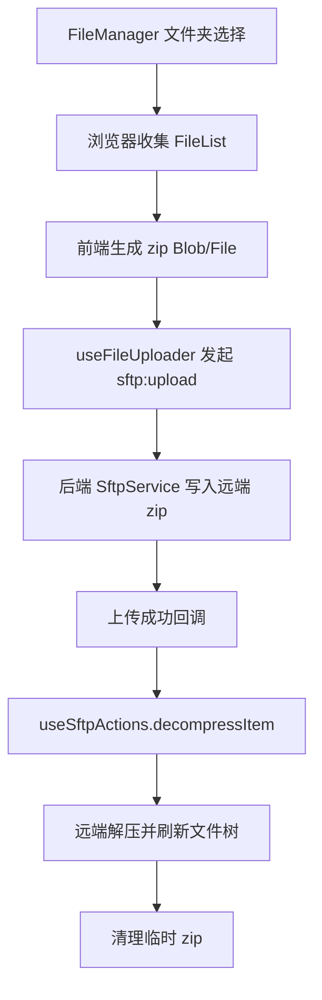

# 变更提案: folder-upload-auto-zip

## 元信息
```yaml
类型: 功能调整
方案类型: implementation
优先级: P1
状态: 已完成
状态说明: 已补齐文件夹选择、浏览器端 zip 上传与远端自动解压，并通过前端构建验证
创建: 2026-03-26
```

---

## 1. 需求

### 背景
当前文件管理器只支持普通文件上传。虽然拖拽目录时已经能递归遍历并逐个上传文件，但面对大量小文件目录时，浏览器侧扫描、前端逐文件分块、后端逐文件创建与远端 SFTP 写入都会显著拉长整体耗时，用户体感接近“卡住”。

### 目标
- 在现有文件管理器中新增明确的“上传文件夹”入口。
- 选择文件夹后，在浏览器端先将目录树压缩为单个 zip，再复用现有上传链路。
- 上传成功后自动调用远端解压，尽量让用户获得“像直接上传文件夹”的结果。
- 普通文件上传保持现有行为，不影响已有入口和拖拽目录上传兼容性。

### 约束条件
```yaml
范围约束: 优先复用现有 sftp:upload 与 sftp:decompress，不新增 REST 上传接口
前端约束: 需要在浏览器端完成目录树收集和 zip 构建
后端约束: 远端自动解压依赖现有服务器命令检测与解压实现
兼容约束: 普通文件上传、现有拖拽上传和文件树刷新逻辑不能回归
```

### 验收标准
- [ ] 文件管理器出现独立的“上传文件夹”入口
- [ ] 选择文件夹后会先压缩为 zip，再作为单次上传任务发送
- [ ] zip 上传成功后会自动触发远端解压
- [ ] 普通文件上传行为保持不变
- [ ] 前后端构建通过

---

## 2. 方案

### 技术方案
在 `FileManager.vue` 中增加第二个隐藏目录选择 input，并将“上传文件”与“上传文件夹”拆分为两个明确入口。前端新增目录压缩逻辑：利用 `webkitdirectory` 返回的 `FileList` 生成目录树，并通过前端 zip 库构建一个临时 `File`/`Blob`。上传层继续走 `useFileUploader` 的 `sftp:upload:start/chunk` 协议，但补充目录压缩任务元数据、成功回调和自动解压回调；上传成功后复用 `useSftpActions` 现有 `decompressItem()` 能力，并在成功后清理临时 zip。

### 影响范围
```yaml
涉及模块:
  - frontend: FileManager.vue、useFileUploader.ts、upload.types.ts、locales
  - backend: 无协议重构，最多仅需适配现有上传/解压消息的边界处理
预计变更文件: 6-10
```

### 风险评估
| 风险 | 等级 | 应对 |
|------|------|------|
| 浏览器端压缩大目录时主线程占用明显 | 中 | 在 UI 中明确显示“压缩中”，并只对显式文件夹入口启用 |
| 远端缺少 unzip 或 tar 命令时自动解压失败 | 中 | 继续复用现有 `sftp:command_not_found` 提示，上传成功但解压失败时给出明确报错 |
| 自动解压后再清理临时 zip 可能因当前目录变更导致删除目标错误 | 中 | 删除逻辑基于上传完成返回的绝对远端路径，而不是依赖当前 UI 路径 |
| 目录名与 zip 临时文件名冲突 | 低 | 为临时 zip 文件名附加固定后缀，避免覆盖现有同名目录/文件 |

---

## 3. 技术设计

### 架构设计


### API设计
本轮不新增独立 HTTP API，沿用现有 WebSocket 消息：

- `sftp:upload:start`
- `sftp:upload:chunk`
- `sftp:upload:success`
- `sftp:decompress`
- `sftp:decompress:success`

前端本地新增的只是上传任务元数据，不改动后端消息协议主体。

### 数据模型
| 字段 | 类型 | 说明 |
|------|------|------|
| `mode` | `'file' \| 'folder-archive'` | 上传任务模式，区分普通文件与目录压缩上传 |
| `archiveFileName` | `string` | 浏览器端生成的临时 zip 文件名 |
| `remoteArchivePath` | `string` | 远端临时 zip 的绝对路径 |
| `decompressAfterUpload` | `boolean` | 上传成功后是否自动触发解压 |
| `cleanupArchiveAfterExtract` | `boolean` | 解压成功后是否自动删除临时 zip |

---

## 4. 核心场景

### 场景: 上传文件夹并自动解压
**模块**: frontend  
**条件**: 用户在文件管理器点击“上传文件夹”，并选择一个本地目录。  
**行为**: 前端将目录内容打包为 zip，上传到当前远端目录，成功后自动调用解压并清理临时 zip。  
**结果**: 远端目录出现解压后的文件夹内容，用户无需手工上传 zip 再解压。

### 场景: 远端缺少解压命令
**模块**: frontend / backend  
**条件**: zip 上传成功，但服务器上没有可用解压命令。  
**行为**: 复用现有 `sftp:command_not_found` / `sftp:decompress:error` 错误反馈。  
**结果**: 用户能看到“上传成功但自动解压失败”的明确信号，并保留上传的 zip 文件用于手工处理。

---

## 5. 技术决策

### folder-upload-auto-zip#D001: 文件夹上传采用“前端压缩 + 现有上传协议 + 远端自动解压”
**日期**: 2026-03-26  
**状态**: ✅采纳  
**背景**: 现有目录上传是逐文件递归上传，小文件多时开销大；而后端已经具备远端解压能力。  
**选项分析**:
| 选项 | 优点 | 缺点 |
|------|------|------|
| A: 保持逐文件目录上传 | 不引入新依赖，链路简单 | 小文件多时扫描与上传时间长，用户体感差 |
| B: 前端压缩成 zip 后上传，再自动解压 | 最大化复用现有协议，明显减少小文件上传请求数 | 前端需要额外压缩逻辑，浏览器端会有打包耗时 |
| C: 后端接收目录流并服务端压缩/展开 | 可把压缩开销从浏览器移走 | 需要重写上传协议与后端缓存链路，改动面过大 |
**决策**: 选择方案 B  
**理由**: 在当前仓库里，这是性能收益最大且改动最小的路径，能复用现有 `sftp:upload` 和 `sftp:decompress`，避免引入新的后端上传接口。  
**影响**: 主要影响 `packages/frontend` 的文件管理器和上传状态管理，后端维持现有 WebSocket/SFTP 能力。

---

## 6. 成果设计

N/A。本轮是现有文件管理器能力增强，不引入新的视觉主题方向，仅延续当前工具栏和上传浮层风格。
