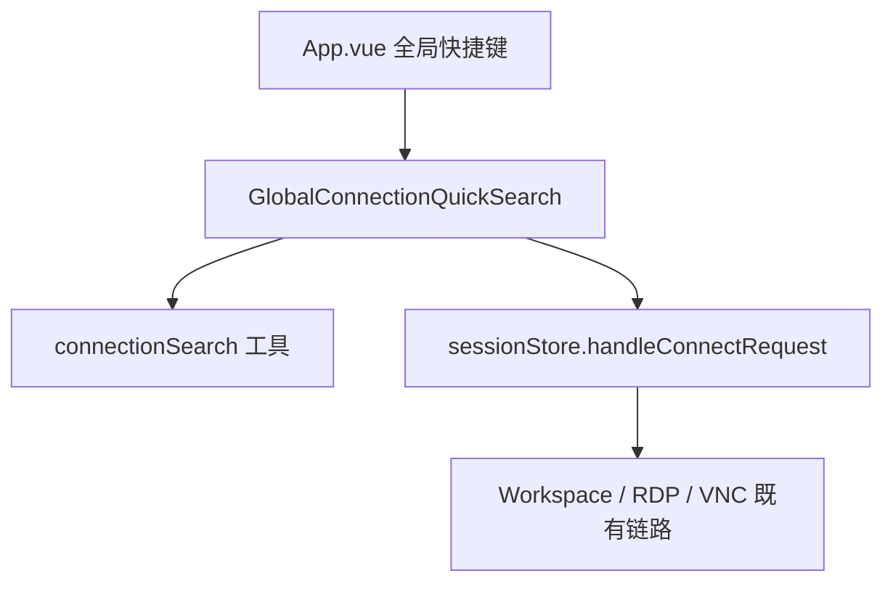

# 变更提案: global-server-quick-search

## 元信息
```yaml
类型: 新功能
方案类型: implementation
优先级: P1
状态: 开发中
状态说明: 为已登录用户新增全局服务器快捷检索面板，复用现有连接链路自动进入工作区或打开远程桌面弹窗
创建: 2026-03-30
```

---

## 1. 需求

### 背景
当前工作区只在局部位置提供服务器搜索与连接能力：顶部 `+` 弹窗里的连接列表支持搜索，`WorkspaceConnectionList.vue` 也支持本地筛选和键盘上下切换，但用户无法在任意已登录页面直接用快捷键唤起“搜索服务器并立即连接”的全局入口。

### 目标
- 为已登录状态新增全局快捷键 `Ctrl+Shift+F`
- 按下后弹出独立输入框/面板，可按关键词模糊检索所有连接类型的服务器
- 支持 `ArrowUp` / `ArrowDown` 在候选结果中切换，`Enter` 选中后自动连接
- 连接动作必须复用现有 `sessionStore.handleConnectRequest()` 链路，保持 SSH / RDP / VNC 的既有行为一致

### 约束条件
```yaml
时间约束: 本轮完成前端最小闭环，不扩展到后端接口和持久化最近搜索
性能约束: 搜索在前端本地完成，结果限制在少量高相关候选，避免每次输入都触发远程请求
兼容性约束: 不破坏现有 Alt 焦点切换、工作区连接列表搜索和既有 SSH/RDP/VNC 连接逻辑
业务约束: 搜索范围固定为所有连接类型（SSH / RDP / VNC）
```

### 验收标准
- [x] 已登录页面按下 `Ctrl+Shift+F` 能打开全局服务器检索面板
- [x] 输入任意关键词后，能对 `SSH / RDP / VNC` 连接做模糊匹配并按相关度排序
- [x] 面板支持 `ArrowUp` / `ArrowDown` 切换高亮项，`Enter` 自动连接，`Esc` 关闭
- [x] 选中 `SSH` 时自动进入 `/workspace` 并按既有逻辑打开/激活会话
- [x] 选中 `RDP / VNC` 时复用现有弹窗逻辑，不破坏原有连接行为
- [ ] 前端构建通过

---

## 2. 方案

### 技术方案
在 `App.vue` 注册全局快捷键监听，新增一个独立的全局连接检索组件承载输入框、结果列表和键盘导航。组件内部使用轻量模糊评分函数，对连接名称、主机、用户名和类型做本地排序；`App.vue` 在面板打开时确保连接缓存已加载，并在用户确认后直接调用 `sessionStore.handleConnectRequest(connection)`，利用现有逻辑处理 SSH 新建/重连、RDP 弹窗、VNC 弹窗和自动路由跳转。

### 影响范围
```yaml
涉及模块:
  - frontend: App.vue 负责全局快捷键监听、面板生命周期和连接提交
  - frontend: 新增全局连接检索组件/工具，负责模糊检索、结果渲染与键盘导航
  - frontend: locale 文案，补齐面板标题、占位符、空态和提示语
预计变更文件: 5-7
```

### 风险评估
| 风险 | 等级 | 应对 |
|------|------|------|
| 全局键盘监听与现有 Alt 快捷键或输入框事件冲突 | 中 | 面板打开时优先消费快捷键，并对 Alt 逻辑加早退保护 |
| 不引入第三方库时模糊匹配排序不稳定 | 低 | 使用“精确包含优先 + 子序列匹配兜底”的轻量评分策略，并限制结果数量 |
| 非工作区页面直接连接遗漏既有跳转逻辑 | 低 | 统一走 `sessionStore.handleConnectRequest()`，由既有 router 负责跳转到 `/workspace` |

---

## 3. 技术设计（可选）

> 涉及架构变更、API设计、数据模型变更时填写

### 架构设计


### API设计
N/A，复用现有前端 store 与路由逻辑，不新增接口。

### 数据模型
| 字段 | 类型 | 说明 |
|------|------|------|
| `GlobalSearchItem` | 前端派生结构 | 由 `ConnectionInfo` 派生，用于面板渲染和提交连接 |
| `query` | `string` | 当前检索关键词 |
| `selectedIndex` | `number` | 当前高亮候选索引 |

---

## 4. 核心场景

> 执行完成后同步到对应模块文档

### 场景: 全局快捷检索并自动连接服务器
**模块**: frontend
**条件**: 用户已登录，位于任意受保护页面，连接数据可从缓存或接口获取
**行为**: 用户按下 `Ctrl+Shift+F` 打开全局检索面板，输入关键词后通过键盘上下选择目标服务器，按下 `Enter` 后提交现有连接链路
**结果**: SSH 自动进入工作区并打开/激活会话，RDP / VNC 继续使用既有弹窗连接逻辑

---

## 5. 技术决策

> 本方案涉及的技术决策，归档后成为决策的唯一完整记录

### global-server-quick-search#D001: 全局快捷检索直接复用 sessionStore 连接入口
**日期**: 2026-03-30
**状态**: ✅采纳
**背景**: 全局检索需要在工作区外也能发起连接，如果复用 workspace 事件总线，会受当前视图是否挂载相关组件影响
**选项分析**:
| 选项 | 优点 | 缺点 |
|------|------|------|
| A: 直接调用 `sessionStore.handleConnectRequest()` | 可跨页面工作，自动复用 SSH/RDP/VNC 与路由逻辑，入口单一 | 需要在 App 层拿到 store 并管理连接数据 |
| B: 复用 `workspaceEmitter` 的 `connection:connect` 事件 | 能沿用部分工作区现有事件流 | 非工作区页面不稳定，依赖 `TerminalTabBar` 等订阅方已挂载 |
**决策**: 选择方案 A
**理由**: 该需求强调“全局”唤起，必须保证不论当前处于仪表盘、连接管理还是工作区都能直达既有连接逻辑，因此直接走 `sessionStore` 是最稳定的主入口
**影响**: 影响 `App.vue`、全局检索组件以及连接缓存加载时机

---

## 6. 成果设计

> 含视觉产出的任务由 DESIGN Phase2 填充。非视觉任务整节标注"N/A"。

N/A，本次为现有前端界面内的功能型弹层增强，沿用项目既有主题变量与组件风格，不单独引入新的视觉体系。
