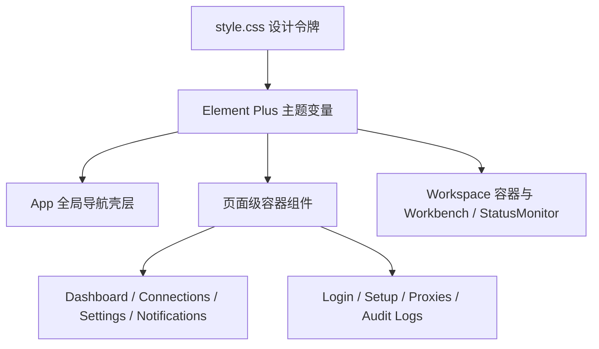

# 变更提案: frontend-slate-control-center

## 元信息
```yaml
类型: 重构 / 优化
方案类型: implementation
优先级: P1
状态: 草稿
创建: 2026-03-25
```

---

## 1. 需求

### 背景
当前 `packages/frontend` 已接入 `Element Plus`，但绝大多数主页面仍停留在早期 Tailwind 原子类和零散自定义变量的混合状态。页面之间的视觉语言不统一，导航壳层、卡片、表格、筛选区、登录/初始化页、工作区侧边工作台都缺少一套一致的“控制中心”设计表达。用户已确认对整个前端站点做统一视觉重做，并指定采用“方案 A: Slate Control Center”。

### 目标
- 建立一套贯穿全站的 Slate Control Center 视觉语言，包括颜色、排版、圆角、阴影、边框、背景层次和状态语义。
- 让顶部导航、主内容区、卡片容器、过滤操作区、表格、表单、标签和空状态统一使用更现代的 `Element Plus` 风格与封装。
- 重做主要页面的壳层和关键交互，包括 `Dashboard`、`Workspace`、`Connections`、`Proxies`、`Notifications`、`Audit Logs`、`Settings`、`Login`、`Setup`。
- 保持现有业务逻辑、Pinia store、路由和多语言能力不变，尽量将改动集中在壳层和组件表达层。

### 约束条件
```yaml
时间约束: 当前轮次内完成可运行的前端重构与构建验证
性能约束: 不引入新的重量级 UI 框架，仅基于现有 Element Plus、Vue 3 和样式层重构
兼容性约束: 保持现有路由、状态管理、组件接口和核心业务流程兼容
业务约束: /workspace 的三栏工作台结构保持既有决策，仅升级视觉语言和容器表达
```

### 验收标准
- [ ] 全局样式令牌和 Element Plus 主题变量统一，顶层导航和页面容器具备一致的 Slate Control Center 风格。
- [ ] `Dashboard`、`Connections`、`Settings`、`Login`、`Setup` 等主页面完成现代化重绘，优先采用 `Element Plus` 容器、表单、标签页、表格、统计卡片等组件。
- [ ] `/workspace` 的 Workbench、终端主区和状态监控面板在视觉上完成统一升级，保留当前结构与主要交互。
- [ ] `npm --workspace packages/frontend run build` 通过。

---

## 2. 方案

### 技术方案
本次改造以“壳层统一 + 样式令牌统一 + 主页面容器重做 + 工作区局部深度优化”为主：

- 在全局样式层重建 `style.css`，统一品牌色、页面背景、面板层级、边框、阴影、字体和 `Element Plus` CSS 变量映射。
- 在应用壳层引入统一页面容器、导航信息层、操作条和页面标题表达，逐步替换现有分散的 Tailwind 片段。
- 对主页面优先使用 `Element Plus` 的 `ElContainer`、`ElCard`、`ElTabs`、`ElTable`、`ElForm`、`ElInput`、`ElButton`、`ElTag`、`ElEmpty`、`ElAlert`、`ElSegmented` 等组件表达。
- 对 `/workspace` 保持布局树与会话逻辑不变，只重做 Workbench、状态监控、终端外围容器和工作区背景层次。
- 尽量新增轻量公共组件，减少把整套视觉逻辑硬编码在每个 view 里。

### 影响范围
```yaml
涉及模块:
  - frontend: 全局样式令牌、应用壳层、主页面容器、工作区视觉重构
  - workspace-root: 仅同步上下文与变更记录，不改变后端/部署逻辑
预计变更文件: 12-20
```

### 风险评估
| 风险 | 等级 | 应对 |
|------|------|------|
| 全局样式变量重写影响现有细节组件 | 中 | 保留核心语义变量名，优先在壳层和新公共组件内消费 |
| 旧页面使用大量原子类，迁移后局部布局错位 | 中 | 先重做公共壳层与主页面，再做工作区和高复杂页面 |
| Element Plus 引入更多容器后局部交互样式不一致 | 中 | 统一页面级卡片、表单、筛选条和表格封装 |
| 工作区组件过多，若全量重写会超出单轮范围 | 低 | 聚焦外层容器、Workbench、状态监控与终端壳层，不动核心终端协议与会话逻辑 |

---

## 3. 技术设计

### 架构设计


### 关键设计拆分
- 建立全局设计令牌层：背景分层、标题字体、面板边框、状态颜色、交互高亮、玻璃化和工业控制台感阴影。
- 构建公共页面壳层：统一页面标题、描述、右侧操作区、统计条和内容区卡片边界。
- 重做主要页面表达：从“表单/列表堆叠”升级为“控制中心”型信息组织。
- Workspace 采用“Slate 控制台”表达：左侧工作台像资源侧栏，中部终端维持主位，右侧状态监控更像运维仪表卡片。

---

## 4. 核心场景

### 场景: 主站点统一视觉语言
**模块**: frontend
**条件**: 用户进入 Dashboard、Connections、Settings 等主要页面
**行为**: 页面统一使用 Slate Control Center 风格的壳层、卡片、筛选区和内容容器
**结果**: 主站点视觉语言一致，Element Plus 使用比例显著提升

### 场景: 工作区现代化控制台
**模块**: frontend
**条件**: 用户进入 `/workspace`
**行为**: 维持三栏结构不变，但重做背景层次、Workbench 容器、状态卡片和终端外围外观
**结果**: 工作区看起来像现代控制中心，而非原始拆分面板

### 场景: 认证入口统一品牌化
**模块**: frontend
**条件**: 用户访问 `/login` 或 `/setup`
**行为**: 登录与初始化页面共享统一品牌板式、表单容器和引导文案层次
**结果**: 首次进入体验与主站点风格统一

---

## 5. 技术决策

### frontend-slate-control-center#D001: 以全局令牌 + 页面壳层重构替代逐页零散修补
**日期**: 2026-03-25
**状态**: 已采纳
**背景**: 现有页面风格分散，若继续逐页修补会反复复制样式，且无法建立统一设计语言。
**选项分析**:
| 选项 | 优点 | 缺点 |
|------|------|------|
| A: 先重建全局令牌和壳层，再逐页替换 | 一致性强，后续页面改造成本更低 | 首次改动面更大 |
| B: 逐页局部替换样式类 | 单页改动小 | 风格难统一，维护成本高 |
**决策**: 选择方案 A
**理由**: 用户明确要求“改整个前端站点，所有主要页面统一重做视觉语言和组件风格”，必须先建立统一底座。
**影响**: `style.css`、`App.vue`、主要视图文件、部分工作区组件都会调整

### frontend-slate-control-center#D002: 主要页面优先采用 Element Plus 容器与表单表达
**日期**: 2026-03-25
**状态**: 已采纳
**背景**: 仓库已引入 `Element Plus`，但当前使用率极低，无法体现组件库一致性。
**选项分析**:
| 选项 | 优点 | 缺点 |
|------|------|------|
| A: 以 Element Plus 为主，Tailwind 负责间距和局部布局 | 组件统一、主题变量统一、开发效率更高 | 需补主题映射 |
| B: 继续主要依赖 Tailwind 原子类 | 灵活 | 风格容易继续碎片化 |
**决策**: 选择方案 A
**理由**: 与用户要求直接一致，并且 Element Plus 已在依赖和入口中可用。
**影响**: 主页面会增加 `ElCard`、`ElInput`、`ElButton`、`ElTabs`、`ElTable` 等使用

---

## 6. 成果设计

### 设计方向
- **美学基调**: Slate Control Center。整体是石板灰、雾面蓝灰、冷白高光的专业控制中心，不走炫技霓虹，也不回到传统后台白底表格。
- **记忆点**: 顶层导航和各页面的“控制台头部条”，带有浅层玻璃感、信息徽标和有节奏的卡片层级，形成像现代运维控制中心的视觉记忆。
- **参考**: xterminal 的控制台感布局重心 + Element Plus 的信息密度与组件一致性 + 工业面板式层级。

### 视觉要素
- **配色**: 主背景使用深浅交叠的 slate 灰蓝体系，内容面板使用高亮浅灰卡片，强调色使用冷蓝与青绿色，危险态保留橙红。
- **字体**: 标题使用更有控制台气质的窄体/几何感字体栈，正文使用清晰的中文优先无衬线；代码和状态数字保持等宽字体。
- **布局**: 顶部导航更扁平且信息化；主页面采用“标题信息头 + 统计带 + 主内容卡片”的层次；Workspace 保持三栏但加重容器感与边界感。
- **动效**: 页面头部、卡片和标签切换采用短促的位移与透明度过渡；悬停强调边框和阴影，不堆砌复杂动画。
- **氛围**: 背景带有轻微径向渐变和柔和网格/噪点质感，卡片使用浅玻璃边缘和柔和阴影，突出现代专业控制中心质感。

### 技术约束
- **可访问性**: 保持表单、按钮、标签页和表格的键盘可达性，确保浅色文本对比满足阅读要求。
- **响应式**: 主站页面在桌面优先，保留既有移动端退化逻辑；Workspace 移动端不改变现有交互链路。
